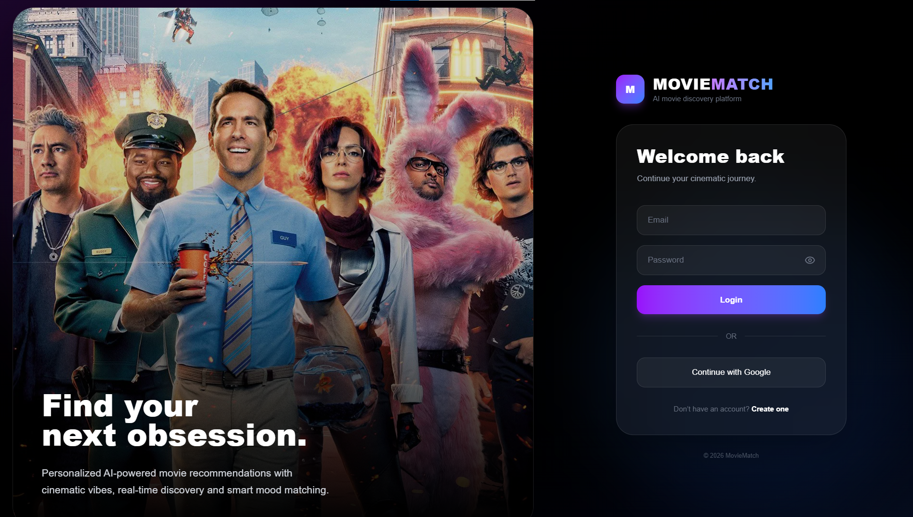
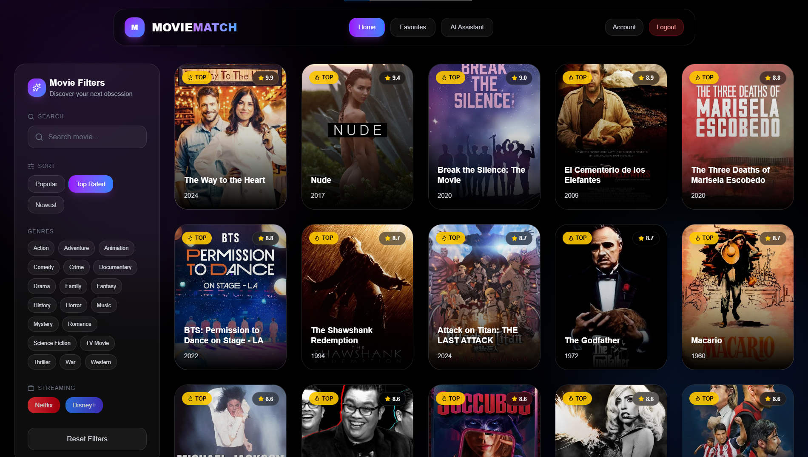
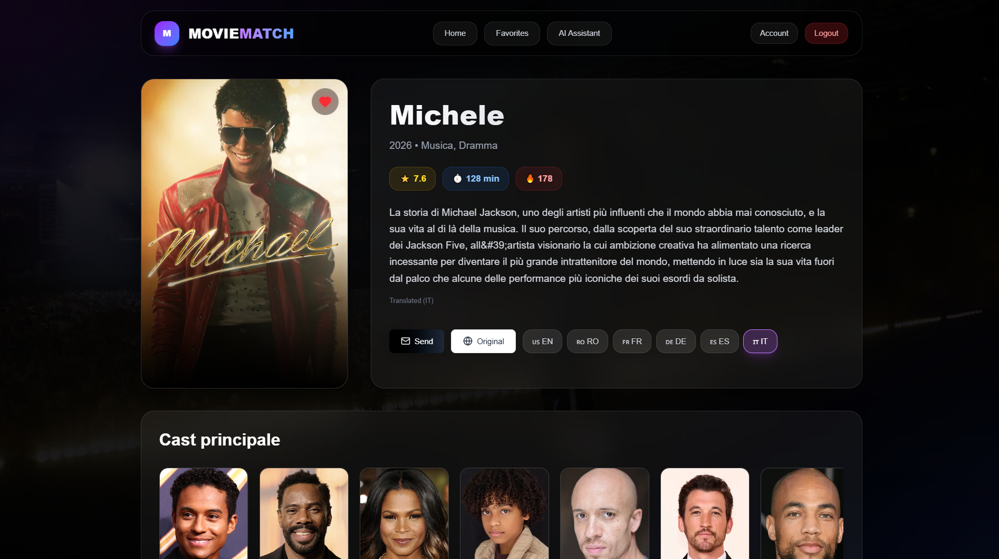
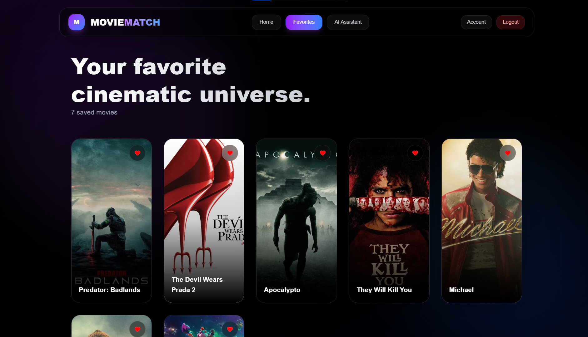
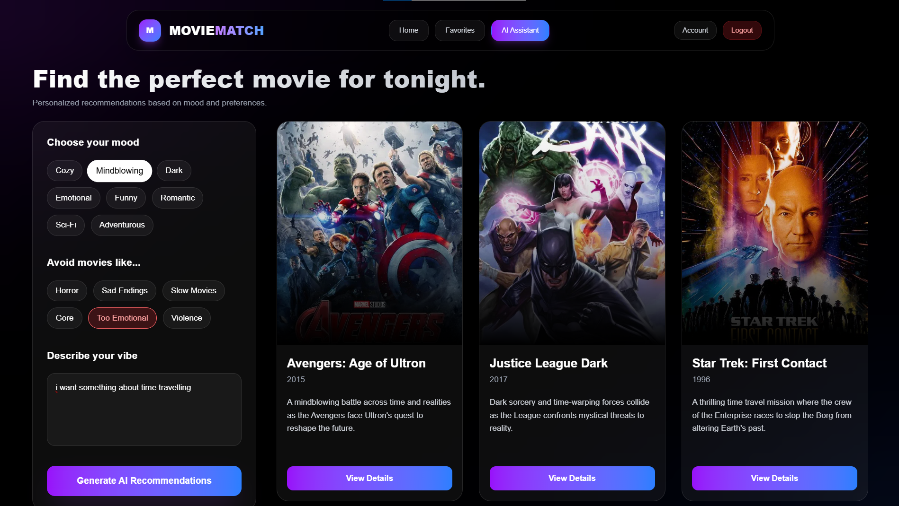

# 🎬 MovieMatch – AI Movie Recommendation Platform

Damoc Iulia Francisca
Grupa 1145  

---

## 🔗 Demo

- 🌍 Live app: https://movie-match-app-three.vercel.app/
- 🎥 Video prezentare: https://youtu.be/VjB_TXyVQwc 

---

## 1. Introducere

MovieMatch este o aplicație web prin care utilizatorii pot descoperi filme potrivite în funcție de starea lor din acel moment. Ideea aplicației a plecat de la faptul că, de multe ori, este dificil să alegi un film chiar dacă ai foarte multe opțiuni disponibile.

Aplicația folosește inteligență artificială și servicii cloud pentru a oferi recomandări personalizate, dar și funcționalități utile precum salvarea filmelor favorite, traducerea descrierilor sau trimiterea unui film prin email.

---

## 2. Descrierea problemei

În prezent, platformele de streaming oferă un număr foarte mare de filme, însă recomandările nu sunt întotdeauna relevante pentru utilizator, mai ales dacă acesta nu știe exact ce caută.

Problema principală este că:
- utilizatorii pierd mult timp căutând un film
- recomandările nu țin cont de starea emoțională
- nu există explicații clare pentru sugestiile primite

Aplicația încearcă să rezolve aceste probleme prin:
- selectarea unui „mood”
- posibilitatea de a evita anumite tipuri de filme
- utilizarea AI pentru generarea unor recomandări mai relevante

---

## 3. Descriere API

Aplicația folosește mai multe servicii cloud, fiecare având un rol specific:

####  TMDB API
Este folosit pentru a prelua informații despre filme:
- titlu
- descriere
- rating
- poster  
Acest API reprezintă sursa principală de date pentru aplicație.

---

#### OpenAI API
Este utilizat pentru partea de inteligență artificială:
- analizează input-ul utilizatorului (mood, prompt)
- generează keywords relevante
- determină tipul de filme potrivite
- oferă explicații personalizate pentru fiecare film recomandat

---

#### Google Cloud Translation API
Este utilizat pentru traducerea conținutului:
- permite afișarea descrierilor în mai multe limbi
- utilizatorul poate selecta limba dorită
- îmbunătățește experiența aplicației pentru utilizatori internaționali

---

#### Firebase
Este utilizat pentru:
- autentificare utilizator:
  - email + parolă
  - Google login (OAuth)
- stocare date în Firestore:
  - filme favorite
  - informații profil
- sincronizare în timp real

---

#### SendGrid API
Este utilizat pentru trimiterea email-urilor:
- utilizatorul poate trimite un film pe email
- email-ul conține:
  - titlu film
  - descriere
  - link către aplicație

---

## 4. Flux de date
În cadrul aplicației, comunicarea dintre frontend și backend se realizează prin endpoint-uri REST, care procesează datele introduse de utilizator și returnează rezultate relevante.
### 🔄 Exemplu request de tip GET care preia toate informatiile despre un film

GET https://api.themoviedb.org/3/movie/{id}?api_key=API_KEY

### 🔄 Exemplu raspuns (simplificat)

```json
{
    "genres": [
        {
            "id": 10749,
            "name": "Romance"
        },
        {
            "id": 18,
            "name": "Drama"
        }
    ],
    "id": 11036,
    "imdb_id": "tt0332280",
    "original_language": "en",
    "original_title": "The Notebook",
    "overview": "An epic love story centered around an older man who reads aloud to a woman with Alzheimer's. From a faded notebook, the old man's words bring to life the story about a couple who is separated by World War II, and is then passionately reunited, seven years later, after they have taken different paths.",
    "popularity": 17.5918,
    "poster_path": "/rNzQyW4f8B8cQeg7Dgj3n6eT5k9.jpg",
    "vote_average": 7.887,
    "vote_count": 12484
}
```

### 🔄 Exemplu request de tip POST pentru recomandari cu AI

POST /api/ai-recommend

```json
{
  "mood": "Mindblowing",
  "avoid": "Too emotional",
  "prompt": "Something about time travelling"
}
```
### 🔄 Exemplu raspuns (simplificat)

```json
{
  "movies": [
    {
      "id": 24428,
      "title": "Avengers: Age of Ultron",
      "year": "2015",
      "vote_average": 7.3,
      "poster_path": "/poster1.jpg",
      "matchScore": 86,
      "aiExplanation": "A mindblowing battle across time and realities as the Avengers face Ultron's quest to reshape the future."
    },
    {
      "id": 297802,
      "title": "Justice League Dark",
      "year": "2017",
      "vote_average": 7.0,
      "poster_path": "/poster2.jpg",
      "matchScore": 82,
      "aiExplanation": "Dark sorcery and time-warping forces collide as the League confronts mystical threats to reality."
    }
  ]
}
```

### 🔄 Exemplu request GET – preluare filme favorite utilizator

GET /api/favorites?userId=USER_ID

### 🔄 Exemplu raspuns (simplificat)

```json
{
  "favorites": [
    {
      "movieId": 1226863,
      "title": "The Super Mario Galaxy Movie",
      "poster": "/eJGWx2l9ZcEMVQJhAgMiqo8tYY.jpg",
      "genres": [10751, 35, 12, 14, 16],
      "createdAt": "2026-05-07T21:23:07Z",
      "userId": "LcluOOve7ydr14upGlZBep4UkY33"
    },
    {
      "movieId": 1290821,
      "title": "Shelter",
      "poster": "/buPFnHZ3xQy6vZEHxbHgL1Pc6CR.jpg",
      "genres": [28, 80, 53],
      "createdAt": "2026-05-07T17:19:20Z",
      "userId": "LcluOOve7ydr14upGlZBep4UkY33"
    }
  ]
}
```


### 🌐 Metode HTTP utilizate

În cadrul aplicației au fost utilizate următoarele metode HTTP:

#### 🔹 GET
- obținere filme din TMDB API  
- obținere detalii film (`/api/movie/[id]`)  
- preluare date pentru interfață  

#### 🔹 POST
- generare recomandări AI (`/api/ai-recommend`)  
- traducere texte (`/api/translate`)  
- trimitere email (`/api/send-email`)  
- salvare filme favorite în Firestore  

#### 🔹 PUT / UPDATE
- actualizare profil utilizator (nume, avatar)  

#### 🔹 DELETE (logic)
- ștergere film din favorite  

### 🔐 Autentificare și autorizare

Autentificarea este realizată folosind Firebase Authentication:

- login cu email și parolă  
- login cu Google  

După autentificare, utilizatorul poate accesa:

- filme favorite  
- profil utilizator  
- funcționalități personalizate  

---

## 5. Capturi de ecran aplicație







---

## 6. Publicare aplicație

Aplicația a fost publicată utilizând platforma **Vercel**, care este optimizată pentru aplicații dezvoltate cu Next.js.

Procesul de deploy este realizat direct din repository-ul GitHub, ceea ce permite actualizarea automată a aplicației la fiecare modificare adusă codului.

Printre avantajele utilizării Vercel se numără:
- integrarea rapidă și simplă cu GitHub  
- deploy automat la fiecare update  
- configurarea facilă a variabilelor de mediu  
- performanță ridicată și timp de răspuns rapid pentru aplicații web  

---

## 7. Referințe

- https://developer.themoviedb.org/
- https://platform.openai.com/docs
- https://cloud.google.com/translate/docs
- https://firebase.google.com/docs
- https://sendgrid.com/docs/
- https://vercel.com/docs
- https://nextjs.org/docs
- https://react.dev/
- https://developer.mozilla.org/en-US/docs/Web/HTTP
- https://restfulapi.net/